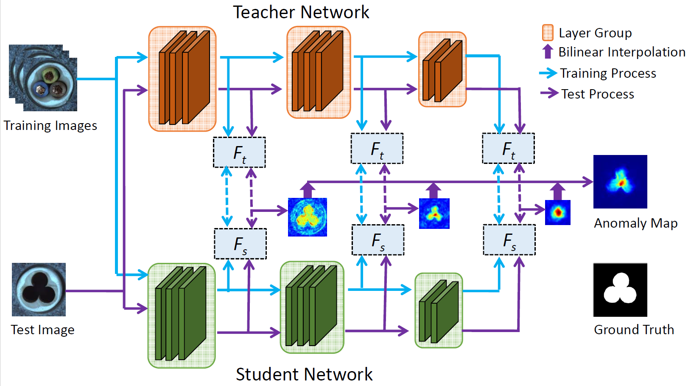

# STFPM
Official pytorch implementation for the paper entitled "Student-Teacher Feature Pyramid Matching for Anomaly Detection" (BMVC 2021)
https://arxiv.org/abs/2103.04257v3




# Dataset
Download dataset from [MvTec website](https://www.mvtec.com/company/research/datasets/mvtec-ad/).


# Training
Train a model:
```
python main.py train --mvtec-ad mvtec_anomaly_detection --category carpet  
```
After running this command, a directory `snapshots/carpet` should be created.

# Testing
Evaluate a model:
```
python main.py test --mvtec-ad mvtec_anomaly_detection --category carpet --checkpoint snapshots/carpet/best.pth.tar
```
This command will evaluate the model specified by --checkpoint argument. You may download the pre-trained models [here](https://drive.google.com/drive/folders/16Ra76UhwY8EZg2SAaJCdFFZfaJbpGhdq?usp=sharing).

For per-region-overlap (PRO) calculation, you may refer to [here](https://github.com/YoungGod/DFR/blob/a942f344570db91bc7feefc6da31825cf15ba3f9/DFR-source/anoseg_dfr.py#L447). Note that it might take a long time for PRO calculation.


# Citation

If you find the work useful in your research, please cite our papar.
```
@inproceedings{wang2021student_teacher,
    title={Student-Teacher Feature Pyramid Matching for Anomaly Detection},
    author={Wang, Guodong and Han, Shumin and Ding, Errui and Huang, Di},
    booktitle={The British Machine Vision Conference (BMVC)},
    year={2021}
}
```
